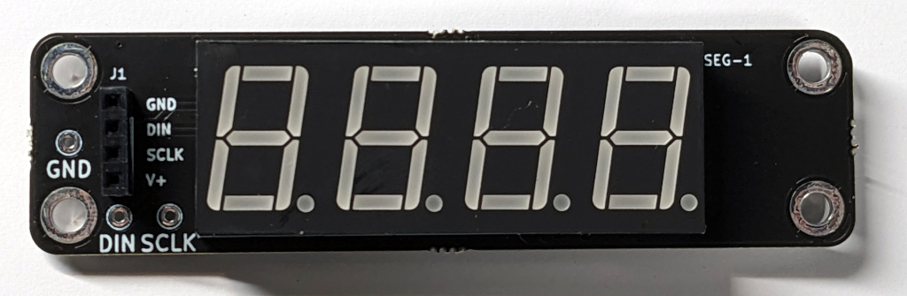
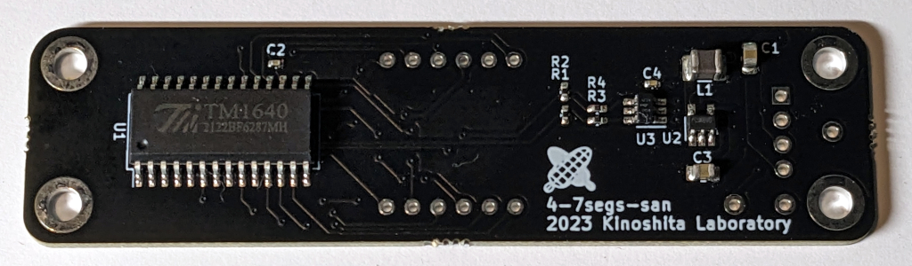
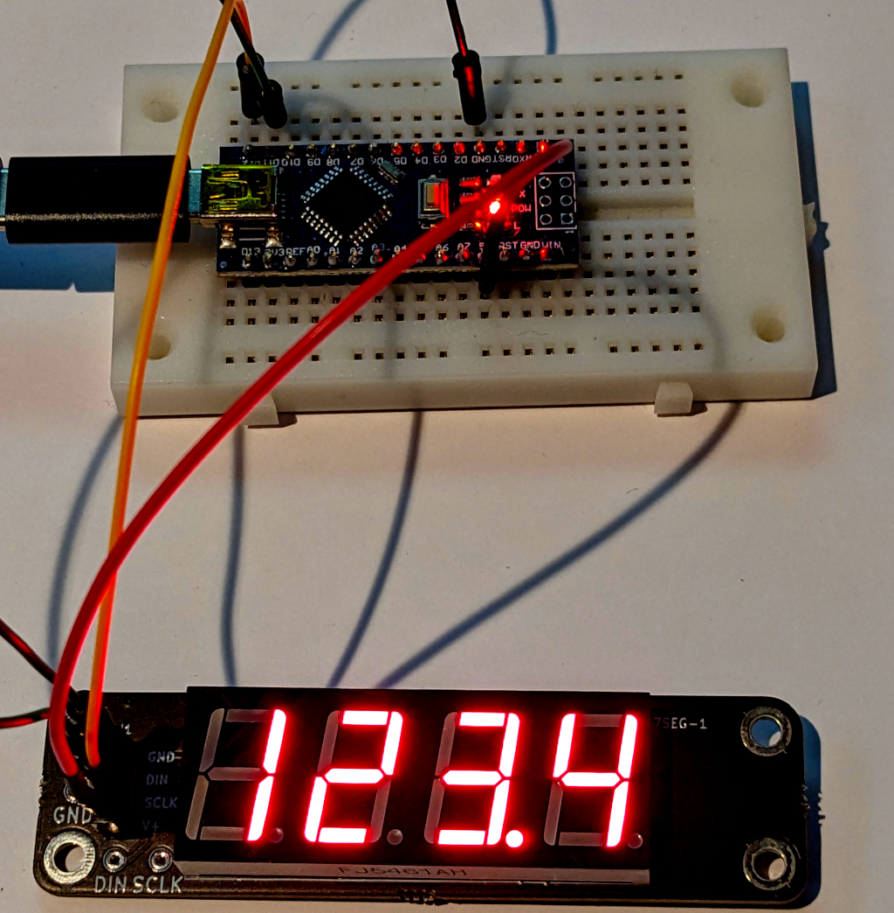

# 4-7segs-san kit

[Document in Japanese](README_ja.md)

4-7segs-san is a handy PCB with 4-digit 7-segment LEDs with decimal point.
You can speed up your MCU project with displaying numbers such as BPM, Level, etc.

## Main Features

- Only 2 GPIO pins required, connected to built in LED Driver(TM1640)
- Compatible for both 5V and 3.3V with builting buffers for signal,  DC-DC converter for power sourcing.
- Easy to use with [dedicated Arduino library for TM1640](./soft/4-7segs-san/TM1640.h)

## Kit Contents

- Pre-assembled circuit board
- [4 digit common cathode segment display](https://www.lcsc.com/product-detail/_Shenzhen-Zhihao-Elec-_C54396.html)
- 1x4 pin socket

## How to assemble

1. Cut all the pins on LED display to approx. 5mm for easier handling.
2. Solder the LED display and pin socket

## Sample program

Please refer to the [soft/4-7segs-san](soft/4-7segs-san)
